# 分层有限状态机

​		总所周知，状态机是一种很常见的设计模式，这里提供了一个强大易用、可视化编辑的分层有限状态机Godot插件。

# 特性

1. 完善的可视化编辑器
2. 支持分层嵌套、可用于复杂情形
3. 多样化的转换方式
4. 两种开发模式：信号回调与附加状态脚本
5. 完全GDscript开发，兼容godot基础版本与mono版本

# 教程

> + 阅读约定：
>
>   ​	HFSM：分层有限状态机（ Hierarchical Finite State Machine )
>
>   ​	FSM：有限状态机(Finite State Machine)
>
>   ​	State: FSM中的 状态 (State)
>
>   ​	Transition :FSM中连接State的转换 （Transition）
>
> + HFSM结构:
>
> 
>

## 一、安装(Installation)

​		与其他插件相同，将addon文件夹里的“hierarchical_finite_state_machine”文件夹复制到您的项目中的addon文件夹中，并在项目设置里启用该插件即可。

> 注意：
>
> ​		在实际使用中请遵守许可证要求(详情请见 LICENSE.md)。
>
> + 完整版本使用得是一个自定义得许可证。
> + 试用版本使用得是GNU Lesser General Public License v3.0。

## 二、认识HFSM编辑器(HFSM Editor)

​		当您在场景树中添加“HFSM”节点并选中该节点，会弹出HFSM编辑器，该编辑器基于GraphEdit实现。


### · 变量列表(Variable List)

​		默认于左上角显示HFSM的变量列表

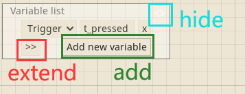
  1. 扩展按钮(extend button)：隐藏或扩展更多信息，扩展后可以调换变量顺序，也可以添加变量注释，如下图：


  2. 添加按钮(add button)：为HFSM添加新的变量。

     > 注意：添加后必须为变量填写唯一的名称，否则该变量在运行时将被忽略

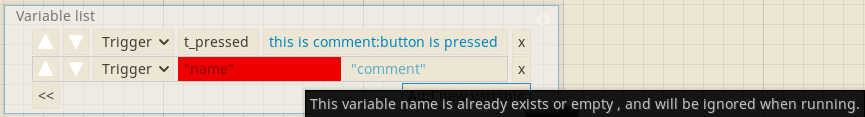

  3. 隐藏按钮(hide button)：在设计状态机时如果该列表妨碍观察，可将其隐藏，并可于右键菜单中恢复该列表的可见性。

### · 变量编辑器(Variable Editor)
​	在变量列表(Variable List)中点击Add new variable按钮，会在变量列表中添加一个变量编辑器.

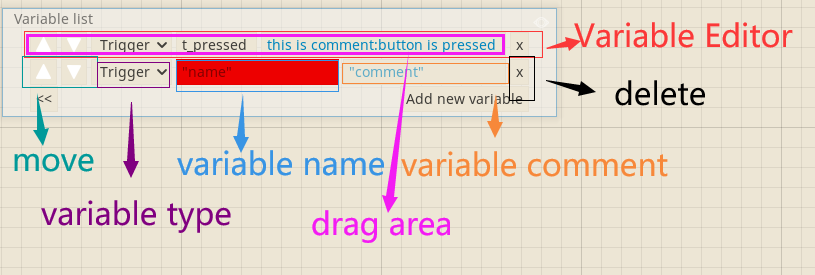

 1. 移动按钮(move button): 当存在多个变量编辑器时，可以移动变量的顺序

 2. 变量类型选项按钮(variable type option button)：点击后会弹出下拉框，用于选择该变量的类型

    

	>    + 触发器(Trigger)：该变量类型被触发后，仅保持一个帧(默认为物理帧，仅在HFSM的Process Mode为Idle时为空闲帧)的触发状态，这一帧结束后将被复位
	>    + 其他变量类型行为与普通变量相同

3. 变量名称(variable name)：变量名称不能为空，或者与现有的重复，否则将在运行时被忽略。

4. 变量注释(variable comment)：非必须，如果您的变量命名不直观，该栏目能帮助您理解变量含义。

5. 删除按钮(delete button)：删除该变量。

6. 拖拽区域(drag area):将该变量拖拽到”Transition Type“ 设置为”Variable“ 的 Transition 的 Inspector中，添加变量表达式（Variable Expression) ,这时候变量才能在HFSM中起作用。

    > 注意：
    >
    > ​		如果变量名称不合法，则该变量无法添加为变量表达式。

### · 右键菜单(Right click Popup Menu)

​	在编辑界面中按下鼠标右键弹出。


 1. 添加状态(Add State)：在当前位置添加State

 2. 创建转换(Create Transition)：在鼠标置于状态之上点击右键时该项目才可用，快捷键：shift + 左键点击

 3. 脚本(Script)：在鼠标置于State之上点击右键时该项目才可用

	a、 打开脚本(Open)：只有该State添加了脚本该项目才可用
	
	b、 创建新脚本(Create new):只有该State未添加脚本该项目才可用，将弹出脚本创建对话框，并在创建成功后自动附加到该State
	
	c、 附加已有脚本(Attach exist)：只有该State未添加脚本该项目才可用，将弹出文件浏览对话框，在确定选中脚本文件后附加到该State
	
	d、 移除脚本(Remove)：只有该State已添加脚本该项目才可用，将移除该State所附加的脚本。
	
	> 注意：
	>
	> ​		只有[符合要求的脚本](#-%E7%8A%B6%E6%80%81%E8%A1%8C%E4%B8%BA%E5%8F%8A%E5%85%B6%E4%BB%A3%E7%A0%81%E6%8E%A7%E5%88%B6state-behavior--code-control)才能被附加到State上。
	
4. 拷贝(Copy)：只有已经选中状态或转换后该项目才可用，将复制选中的State和Transition，快捷键：ctrl+ c

5. 粘贴(Paste)：只有已拷贝对象后该项目才可用，将张贴已拷贝对象，可以跨FSM粘贴，简单的实现复用，快捷键：ctrl + v

   > 注意：
   >
   > + 如果复制的Transition两端的State未被完全复制，则该Transition不会被粘贴。
   >+ 粘贴的State名称将会被添加“_”直到在同一内FSM不再重复。
   
6. 复制(Duplicate)：只有已选中对象后该项目才可用，将选中对象拷贝，进行偏移后粘贴。

   > 注意：
   >
   > + 如果选中的Transition两端的State未被完全选中，则该Transition不会被粘贴。
   >+ 粘贴的State名称将会被添加“_”直到在同一内FSM不再重复。
   
7.  删除(Delete)：只有已选中对象后该项目才可用，将选中的对象删除。

8. 转化为嵌套的FSM(Convert to Nested State Machine)：只有选中对象后，将鼠标置于某一选中State之上点击右键，该项目才可用。即使您设计初期对HFSM的设计不明确，将繁琐的结构设计在一层，也可以很方便的转换为嵌套FSM。

   > 注意：
   >
   > + 点击右键时鼠标所指的State将被设为新生成的嵌套FSM的Entry State。
   >+ 如果将被设为嵌套FSM的State被附加的脚本，则该脚本将被移除，并附加到嵌套FSM里的Entry State。
   > + 所有与选中State连接的Transition如果两端所连的State未被完全选中，除非一端所连的State将被设为嵌套FSM，否则该Transition将被删除。
   
9. 将变量列表置于此处显示(Show Variable List at here)：无论变量列表(Variable List)是否被隐藏，都会将其置于右键点击处显示

### · FSM路径( FSM path)

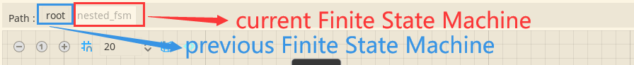

​		该栏目由一组按键构成，指示当前有限状态机的路径，最后一个按键为当前FSM的位置，并且该按键为失能状态，点击前面的按键即可跳转到相应的FSM。

### · 工具栏(Toolbar)

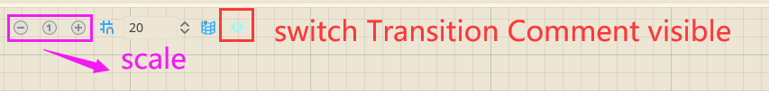

​		最后一个按钮为切换Transition注释的可见性


   > 注意:
   >
   > ​		前三个缩放相关的按钮当前版本不推荐使用 ， 可能会引发一些非致命的bug，目前已知的bug为节点的拖拽异常。
### · 小地图(Mini Map)
​		如果您使用的Godot版本为3.2.3以上，则会在编辑器中显示小地图。
>注意：
>​		目前3.3版本的Godot仍未稳定，不建议投入实际使用，针对该插件，目前小地图的显示也不够好。Transition在小地图的显示将不包含旋转属性。由于Godot文档所提供的小地图属性与API不足以修正该错误 ，已提交Proposal优化小地图的功能。

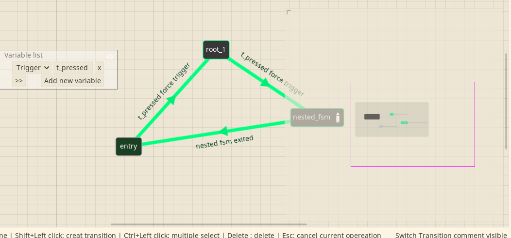

## 三、状态(State)

​		HFSM的最小单元，您可以通过右键菜单创建新的State。

### · 状态监视器属性(State Inspector Properties)


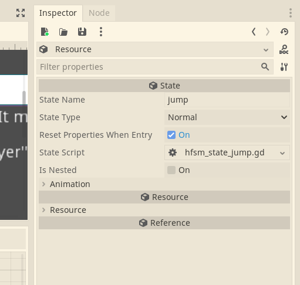

1. 状态名称(State Name)

​		State的名称，在信号回调的代码控制中用于判断 , 不仅用于直接判断当前状态，同时用于指示有限状态机路径，所以请合理的为您的状态进行命名，建议采用蛇形命名法(snake_case)。

> 注意：
>
> ​		选中一个State，并单击其在HFSM编辑器中显示的名称，即可编辑其名称(注意不要连点)。

2. 状态类型(State Type)

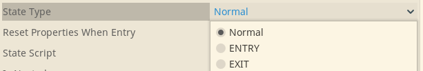

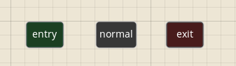

​	a. 通常(Normal) : 最常用的类型，具有完整的State行为（初始化，进入，更新，物理更新，退出）

​	b. 进入(Entry) : 每个FSM都必须包含唯一的一个Entry State，用于指示进入FSM时的起点的State，同样具有完整的State行为。

​	c. 退出(Exit) : 该类型State仅有 初始化 ，进入 ，退出 三种行为。一个FSM中可以包含多个Exit State，用于指示FSM的终点。当FSM运行到Exit State时，该FSM将不再运行，直至手动复位或再次进入该FSM。

> 注意：
>
> ​		Exit State的内嵌FSM不会被运行。

3. 进入时复位属性(Reset Properties When Entry)

   ​		默认勾选该属性，每当进入该State时，将复位所有的自定义属性。如果取消勾选，则进入该State时将保持自定义属性，即不复位。

4. 状态脚本(State Script)

   ​		附加了脚本的State会有添加一层白色方框用作提示，如下图所示：

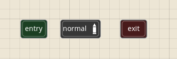

​		推荐通过右键菜单进行状态脚本的创建，添加，移除操作，监视器的状态脚本属性也可以进行编辑，但没那么方便。

​		当前仅支持GDscript脚本，且脚本必须使用插件所提供的”Hfsm State Template“模板，当您通过右键菜单创建脚本时，会默认提供选择该模板。

> 注意：
>
> ​		如果状态已经附加脚本，当您双击这个状态时，将跳转到脚本编辑器并载入该脚本。

5. 被嵌套(Is Nested)

​		当勾选该属性时，该State将会嵌入一个FSM，在State图标上显示进入内嵌FSM的按钮，同时会新增一个属性 ：进入嵌套FSM时复位(Rest Nested Fsm When Entry）


+ 进入嵌套FSM时复位(Rest Nested Fsm When Entry):

  ​	当进入一个被嵌套的状态时，也会进入其嵌套的FSM，如果勾选该属性，进入嵌套的FSM时会对其进行复位，复位行为包括：

  1. 将该嵌套FSM的Entry State和Exit State设置为在编辑器中设置的Entry State和Exit State.
  2. 复位该嵌套FSM中的所有State。

### · 状态行为及其代码控制(State Behavior & Code Control)

​		这是本插件所提供的状态脚本模板。

```python
extends "res://addons/hierarchical_finite_state_machine/script/source/state.gd"

#You can use 'hfsm' to call the HFSM which contain this state , and call it's menbers.
#Please browse document to find API.

###agents list-start# please not modify this line.
###agents list-end# please not modify this line.
###nested fsm state-start# please not modify this line.
###nested fsm state-end# please not modify this line.
#======================================================
#--------------------Custom Signals--------------------
#======================================================

#======================================================
#-------------------Custom Properties------------------
#======================================================

#======================================================
#--------------------Custom Mechods--------------------
#======================================================

#======================================================
#--------------------Override Mechods------------------
#======================================================
#This funcion will be called just once when the hfsm is generated.
func init()->void:
	pass

#Will be called every time when entry this state.
func entry()->void:
	pass

#Will be called every frame if the hfsm's process_type is set at "Idle" or "Idle And Physics",
#and will be called every physics frame if the hfsm's process_type is set at "Physics".
#(In order to ensure the function completeness)
#Note that this method will not be called if this state is an exit state
func update(delta:float)->void:
	pass

#Will be called every physics frame if the hfsm's process_type is set at "Physics" or "Idle And Physics",
#and will be called every frame if the hfsm's process_type is set at "Idle".
#(In order to ensure the function completeness)
#Note that this method will not be called if this state is an exit state
func physics_update(delta:float)->void:
	pass

#Will be called every time when exit this state.
#Note that this method will be called immediatly after entry() if this state is an exit state.
func exit()->void:
	pass

```

+ 状态行为(State Behavior)

​		一个State有5种行为，分别对应脚本模板中的5个可重载方法:

+ 初始化  init() : 在HFSM生成时执行，一般用于变量的初始化，获取对象等，该行为执行之后，所有的变量将被确定为初始值。

+ 进入  entry() : 每次进入到State时执行。

> 注意：
>
> ​		如果该状态具有内嵌的FSM，则会进一步执行该FSM中Entry State的进入行为。

+ 更新  update(delta:float) : 当前HFSM执行路径中如果包含该State，将在Godot的主循环(main loop)的处理步骤(processing step)中被执行，这意味着帧率不稳定，其中delta为当前帧的时长，单位为秒。(类比Node._process(delta))

> 注意：
>
> + 如果该状态具有内嵌的FSM且未被终止，则会进一步执行该FSM中当前State的更新行为。
> + 如果State类型为Exit State ，则不会执行更新行为。

+ 物理更新  physics_update(delta:float) :  当前HFSM执行路径中如果包含该State，将在Godot的主循环(main loop)的物理处理步骤(physics processing step)中被执行，这意味着帧率恒定，其中delta为当前物理帧的时长，单位为秒。(类比Node._physics_process(delta))

> 注意：
>
> + 如果该状态具有内嵌的FSM且未被终止，则会进一步执行该FSM中当前State的物理更新行为。
> + 如果State类型为Exit State ，则不会执行物理更新行为。

+ 退出  exit() : 当退出状态时执行。

> 注意：
>
> + 如果State类型为Exit State，则 更新 和 物理更新 两种行为不会被执行，且 退出行为 将在 进入行为 执行后立即执行。
> + 如果该State具有运行中的内嵌FSM，则会获取内嵌FSM的当前State，如果这个当前State仍然具有内嵌的FSM，则会一直追溯下去，直到最后的State没有内嵌的FSM，然后按照获取与相反的顺序，依次执行这些State的退出行为，同时终止这些内嵌的FSM，最后再执行本State的退出行为。
> + 如果State已经退出，如果具有内嵌FSM，则其嵌套的FSM不会继续运行。

2. 状态脚本模板的使用(The Usage of State Script Template)

+ 使用状态脚本时的注意事项:

  ​		使用该模板不仅让您能方便构建状态的功能，更是为了能然HFSM的设置同步到脚本中，因此有些需要注意的地方。

  + 确保脚本类的正确继承路径：

    ```python
    extends "res://addons/hierarchical_finite_state_machine/script/source/state.gd"
    ```

    > 只有正确当脚本正确继承自该路径的脚本才能在生成HFSM时被实例化。

  + 确保用于标记的注释有着正确的文本：

    ```python
    ###agents list-start# please not modify this line.
    ###agents list-end# please not modify this line.
    ###nested fsm state-start# please not modify this line.
    ###nested fsm state-end# please not modify this line.
    ```

    > 只有不改变这四行注释，HFSM对代理的配置、及内嵌FSM的State对象才能正确的被同步到状态脚本中（原因在于该插件对其同步采用的是匹配文本的方式）。

​		只有满足以上两个条件的脚本才能被附加到State上。但是您可以在附加后进行修改，且插件不会对其进行实时的合格性检测，在此强烈建议您不要对模板中的这5行文本作任何修改，以保证在脚本中获得完整的附加功能。


+ 代理节点(Agent Node) 和 内嵌了FSM的State(State which contain Nested FSM):

  ​		当您在HFSM监视器中正确设置代理(详见[HFSM监视器属性](#-hfsm%E7%9A%84%E7%9B%91%E8%A7%86%E5%99%A8%E5%B1%9E%E6%80%A7hfsms-inspector-porperties))之后,会在所有属于该HFSM里的状态脚本中添加一系列代表代理节点的变量,示例如下:
  
  ```python
  ###agents list start# please not modify this line.
  const Player = preload("res://addons/hierarchical_finite_state_machine/demo/test_2d_platform_player/Player.gd")
  var player : Player 
  ###agents list end# please not modify this line.
  ```
  
  ​		当您内嵌了FSM的State有附加的状态脚本，本插件会自动为其内嵌FSM中附加了脚本的所有State添加一个代表该State的变量，且变量名为”fsm_xxx“ , "xxx" 为该State的名称，其类型引用自该状态的脚本，示例如下：
  
  ```python
  ###nested fsm state-start# please not modify this line.
  const NestedFsmState = preload("res://addons/hierarchical_finite_state_machine/demo/hfsm_test/hfsm_state_nested_fsm.gd")
  var fsm_nested_fsm : NestedFsmState
  ###nested fsm state-end# please not modify this line.
  ```
  
  ​		因此，您在构建HFSM的State行为时，可以很方便的调用HFSM之外的节点和State所属的FSM所内嵌的State实例中的成员。
  
  > 注意：
  >
  > ​		请不要手动修改这些变量或类名，也不要手动为其赋值，它们将在HFSM生成时赋值。

​	

## 四、转换(Transition)


​		用于连接State，确定转换的流向，当满足条件时进行State的切换，既可以通过右键菜单进行创建、也可以通过快捷键Shift+left click进行点击创建。当您选中了一个Transition后，其监视器属性如下：

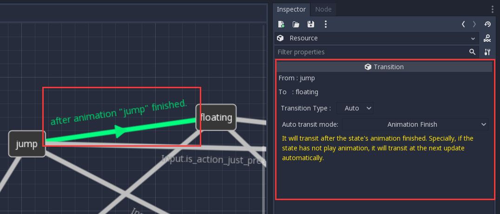

​		前两个属性均不可编辑，仅指示该Transition两端所连接的State。

​		目前有三种类型的Transition(自动、变量、表达式)，足以应对绝大多数情况。通过监视器中的Transition Type对Transition的类型进行选择。


### · 状态的转换行为(State Transit Behavior)

​		当转换条件为真时，会进行State的转换，一个完整的转换行为包括：

​		退出当前的State（执行状态脚本中的exit()）,进入Transition所指向的目标State（执行目标状态中的entry()）。

### · 自动转换(Auto Transition)

  ​		具有5种模式，通过监视器中Auto transit mode进行选择。

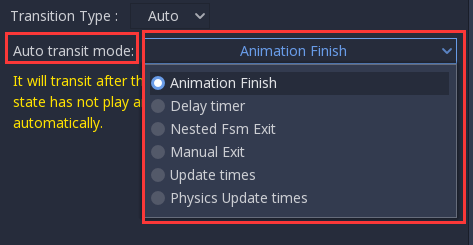

  1. 延时定时器(Delay timer):

     

     ​		该模式下，通过配置延时时间(Delay time)，当FSM进入该Transition的起始State时，该Transition会根据您设置的延时时间开始倒计时，当倒计时结束后，该转换的条件为真。

  2. 内嵌状态机退出(Nested Fsm Exit)：

    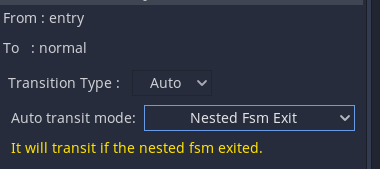
    
    ​		只有当该转换的起始状态是内嵌了FSM的State时，该Transition的转换条件才有可能为真。当起始State的内嵌FSM运行到Exit State并执行完退出行为后，该转换条件为真。
    
  3. 手动退出(Manual Exit)：
    
    
    
    ​		该模式下，当该转换的起始状态脚本中在正常的状态行为中通过代码调用了manual_exit()时，该Transition的转换条件为真。
    
  4. 更新次数(Update times):

     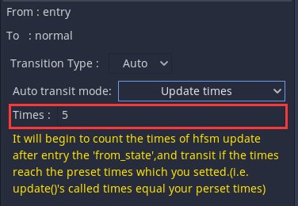

     ​		该模式下，当FSM进入到该Transition的起始State时，会开始计数更新的次数（即update()执行的次数），当达到您设定的次数时，该Transition的转换条件为真。

  5. 物理更新次数(Physics Update times):

     

     ​		该模式下，当FSM进入到该Transition的起始State时，会开始计数物理更新的次数（即physics_update()执行的次数），当达到您设定的次数时，该Transition的转换条件为真。

### · 变量转换(Variable Transition)

​		通过对其添加变量表达式(Variable Expression),设置该Transition的转换条件。该类型足以应对绝大多数情况。

> 注意：
>
> ​		如果未添加变量表达式则该转换的条件不会为真。

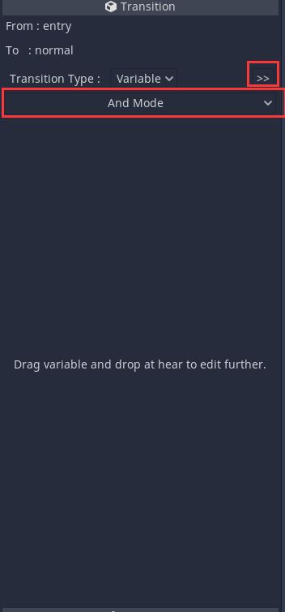

​		通过拖拽变量列表(Variable List)中的变量到监视器中，可以为该变量添加变量表达式：

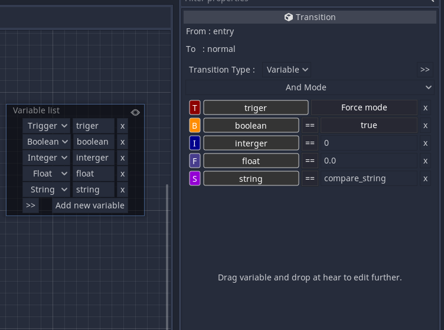

> 当您按下扩展按钮后，可以显示变量表达式的更多信息,且可以调换表达式的顺序：
>
> 
1. 操作模式(Operation Mode)：


+ "与" 模式（And Mode）: 只有当所有变量表达都满足时，该Transition的转换条件才为真。

+ "或" 模式（Or Mode）:只要有变量表达式满足时，该Transition的条件就为真。

2. 变量表达式编辑器(Variable Expression Editor):

​		当您拖拽变量到变量转换的监视器中，会根据变量类型添加一个变量表达式编辑器。您可以编辑变量表达式的比较符、比较值，或触发模式。注意比较值应与变量类型相匹配。

|              |         Trigger          | Boolean  |         Integer          |          Float           |  String  |
| :----------: | :----------------------: | :------: | :----------------------: | :----------------------: | :------: |
|  Comparator  |                          | == ;  != | == ; != ; > ; >= ; < ;<= | == ; != ; > ; >= ; < ;<= | == ;  != |
| Trigger Mode | Force mode ; Normal mode |          |                          |                          |          |

+ 比较符：与您在代码中编写表达式时的含义相同。
+ 触发器的触发模式：触发器变量在代码控制中通过set_variable()或set_trigger()触发，对所属的Transition的转换条件影响不同：
  + 强制模式（Force mode）: 当该触发器被触发时，无论该变量转换的操作模式是什么、以及其他变量表达式是否也满足，该Transition的转换条件都为真。
  + 通常模式（Normal mode）: 作为一个普通的变量表达式 ，遵循变量转换的操作模式约束，即：
    + 如果为 "与"模式，只有当其他变量表达式均满足，且该触发器被触发时，该Transition的转换条件为真；

    + 如果为 "或"模式，当有其他变量表达式满足，或触发器本身被触发，该Transition的转换条件为真。
### · 表达式转换(Expression Transition)

​		这是自由度最高的转换类型，可以应对几乎所有的情况。但相对的，尽管在宏观上微乎其微，该类型可能需要消耗比变量转换更多的性能。


+ 上方的文本编辑器用于输入表达式：

  ​		您可以使用的对象标识符包括：

  + "hfsm"：HFSM
  + "from_state" : 该Transition所连接的起始State
  + "to_state" ：该Transition所连接的目标State
  + 所有配置于HFSM的代理节点名称：相应的代理节点对象
  + 所有Godot内建的单例,如Input，您可以在Godot文档中的第二项‘@GlobalScope’中找到它们。

+ 下方的文本编辑器可用于添加注释，如果您的表达式非常复杂，添加注释可以让你更好的理解表达式的含义。

  ​		默认情况下会有一段默认的注释，以提示您的输入。

> 注意：
>
> +  该文本编辑器并未提供代码补全，错误提示等功能，因此，当您输入表达式时，需要自行仔细确认输入是否有误，否则可能会在运行时出现错误。
> + 表达式对于新手来讲可能是一个容易混淆的概念，注意不要写成函数、赋值语句、返回语句等。

 ### · 多转换(Multiple Transitions)

​		当多个Transition的起始State相同，且有复数转换条件为真时，虽然不会出现随机选择一个Transitions进行转换，但是其优先顺序对开发者是不透明的，因此，当您设计转换条件时，应避免多个起始State相同的Transitions能够在同一帧里的转换条件为真。

## 五、有限状态机(Finite State Machine - FSM)

+ 多个State以及与连接他们的Transitions共同构成一个FSM，它既可以是单独的(有且仅有一个称为"root"的FSM)，也可以是嵌套于某一State之中的嵌套FSM。

+ 一个FSM必须有且仅有一个EntryState，用于指示FSM的起点。

+ 一个FSM可以有多个或没有Exit State,用于指示FSM的退出。当执行完Exit State的退出行为，将终止该FSM的运行。

  > 注意：
  > + 如果FSM root运行到Exit State ,则在该State的退出行为结束后，将终止整个HFSM的运行
  > + 一个FSM的运行被终止，意味着该FSM中的所有State行为将不再进行，然而，这并不会妨碍被该FSM嵌套的State的行为
  
+ FSM路径(FSM path):

  ​		每个State虽然在同一FSM中不允许重复 , 但是跨越层级之间的State名称是允许重复的 , 直接使用被FSM嵌套的State名称作为该FSM的唯一标识显然是不合适的 ;如果另外为每个FSM进行命名,则需要开发者自行规范命名 , 可能产生含义不清晰的情况，并且不方便跨层级之间的操作。

  ​		为解决FSM标识的问题，本插件采取一种路径的形式为其进行标识。每个FSM都有一个用于标识自身的路径属性，该属性为一个Array类型 。注意：FSM root的路径为["root"]。

  ​		举个例子，一个名为"state"的State, 其嵌套的路径为"root"->"nested_state_level_1"->"nested_state_level_2"->"state" ,

  则"state"所处的FSM路径为["root" , "nested_state_level_1" , "nested_state_level_2"]。您可以通过索引获取上一层级State的名称，也可以通过裁剪或修饰该路径数组，用于控制其他FSM中的State。

## 六、分层有限状态机(Hierarchical Finite State Machine - HFSM)


### · HFSM的监视器属性(HFSM's Inspector Porperties)

​		当你在场景树（Scene Tree）中选中HFSM节点时，监视器会显示其属性如下：


1. 激活(Active)

​		控制HFSM是否运行

2. 进程类型(Process Type)

​		控制HFSM的进程类型，主要影响FSM中的State的行为及HFSM信号发射的时机


进程类型差异如下：

​	最左侧一栏，update()与physics_update()为State内嵌脚本的函数，signal emit timing 为各信号发射时机。

|  | Idle And Physics | Idle | Physics | Manual |
|:----:|:------------------:|:----:|:-------:|:------:|
| update()/signal :updated | _process() | _process() | _physics_process() | manual_update() |
| physics_update()/signal:physics_updated | _physics_process() | _process() | _physics_process() | manual_physics_update() |

​		此处仅简单预览各进程类型差异。实际使用时建议采用Idle And Physics,合理管理您的自定义行为（如对帧率的稳定性需求等），这点与您在其他节点中使用_process() 与 _physics_process()相同。

> 注意:
>
> ​		若非特殊情况，不建议使用Manual，该类型将HFSM设置为手动模式，只有您调用HFSM的manual_update()  或	manual_physics_update()时才会更新HFSM，而且，不像Idle与Physics模式，HFSM仍会调用状态脚本中update()与physics_update()方法，以保证该State在这一帧的功能完整性，Manual模式仅会调用相应的方法。所以，当您在使用该模式时，请确保您清楚在做什么。

3. 代理(Agents)

​		这是一个字典属性，用于添加代理节点：

> 代理节点（Agent Node）：为了能在编写状态脚本时方便的调用场景中的其他节点而加入的概念。当您为HFSM设置了代理节点后，将在状态脚本中自动添加一系列代表代理节点的被确定类型的变量，并将在正式运行时为这些变量赋予正确的对象。(详见[状态行为及其代码控制](## · 状态行为及其代码控制(State Behavior & Code Control)))

​		


​		该属性会自动添加一栏 key为”null",value 为空Nodepath的键值对，可以方便的添加场景树中的节点，无需手动更改类型与添加键值对。


​		根据Godot的命名约定，一般情况下节点命名遵循驼峰命名法(CamelCase)，而变量名遵循蛇形命名法(snake_case)，为省略命名操作，将会自动将节点名称转化为蛇形命名法。如果您不需要该功能，可以在高级设置中关闭。

> 注意：
>
> + 如果添加的代理节点已经被添加，则不能重复添加。
>
> + 如果添加的代理节点名称与已被添加的代理节点名称重复，则新添加的代理节点名称会被附加“_”，直到不再重复。

4. 自定义类列表(Custom Class List)

   **完整版特有功能**

​		这是一个字典属性，用于添加自定义类：
​		如果您的代理节点是一个自定义类，并且未用class_name关键字定义为全局类，则可以将脚本绝对路径（右键点击文件系统中的脚本，在点击copy path即可复制其绝对路径）添加到该列表中，您的自定义类型的代理节点被添加到状态脚本后将具有自定义类型的属性与方法。这在该自定义类不需要暴露给全局且有多个自定义属性或方法需要调用时将非常有利于代码补全。

​		根据Godot的命名约定，文件名称遵循蛇形命名法（snake_case) , 而类名遵循驼峰命名法（CamelCase），所以将会按照脚本文件名称转换为遵循驼峰命名法的自定义类名称。 

​	

> 注意：
>
> + 如果新添加的路径已经存在，则不会重复添加
>
> + 如果新添加的文件类名已经存在，则会被附加"_"直到不重复

5. 调试(debug)

   **完整版特有功能**

​		勾选后将在运行时窗口的左下角显示一个简单的调试器，用于指示当前的状态路径。


​		按路径从左到右，每一列最上方为当前所处级别的嵌套FSM或State的名称，其中，暗红色为上一次退出状态，半透明的为已过去的状态，将在5秒后不再显示。

6. 高级设置(Advanced  Setting)


+ 禁用按照蛇形命名法重命名(Disable Rename To Snake Case)：勾选该属性后，代理节点在状态脚本中将使用其节点名称作为的对应变量的变量名称。
+ 强制所有State的进入行为(Force All State Entry Behavior):


​		a. 不进行任何强制行为（Not Force) : 默认为该模式，所有State的进入行为均由自身设置决定。

​		b. 强制复位(Force Reset) :  该模式下，所有State在进入时，所有自定义属性将会被复位为初始化的值。

​		c. 强制保持(Force Persist) : 该模式下，所有State在进入时，所有自定义属性不会被复位。

> 注意：
>
> ​		即使设置为强制复位（Force Reset) ，在进入状态时，所有内置属性（包括：State类内部所用变量、代理节点变量、内嵌状态机变量）均不会被复。
>

+ 强制所有FSM的进入行为(Force All Fsm Entry Behavior) : 


​		a. 不进行任何强制行为(Not Force) : 默认为该模式，所有FSM的进入行为均由自身设置决定。

​		b. 强制复位(Force Reset) :  该模式下，所有FSM在进入时均都会执行[FSM的复位](#-%E7%8A%B6%E6%80%81%E7%9B%91%E8%A7%86%E5%99%A8%E5%B1%9E%E6%80%A7state-inspector-properties)。

​		c. 强制保持(Force Persist) : 该模式下，所有FSM在进入时均不执行[FSM的复位](#-%E7%8A%B6%E6%80%81%E7%9B%91%E8%A7%86%E5%99%A8%E5%B1%9E%E6%80%A7state-inspector-properties)。


​    

### · HFSM的运行(The running of HFSM)

1. 当游戏正式运行时，在HFSM加入场景树后，所有的FSM，State，Transition均会被实例化，并执行所有State的初始化行为。

2. 当HFSM启动时，将执行FSM root中Entry State的进入行为，如果State具有内嵌的FSM，则会进一步执行该FSM中Entry State的进入行为，以此类推，直到最后的一个Entry State没有内嵌的FSM。

3. 每当HFSM执行更新，会从FSM root的当前State开始执行更新行为，如果该State具有内嵌的FSM，则会进一步执行该FSM中当前State的更新行为，以此类推，直到最后的一个State没有内嵌的FSM。

4. 每当HFSM执行物理更新，会从FSM root的当前State开始执行物理更新行为，如果该State具有内嵌的FSM，则会进一步执行该FSM中当前State的物理更新行为，以此类推，直到最后的一个State没有内嵌的FSM。

5. 每当FSM中有State进行了转换，在执行完State转换行为后，如果目标State具有内嵌的FSM，则会进一步执行该FSM中的Entry State的进入行为，如果该Entry State具有内嵌的FSM，以此类推，直到最后一个Entry State没有内嵌的FSM.
6. 每当有FSM进入Exit State，如果该Exit State具有内嵌的FSM，找到该FSM的当前State，如果该State具有内嵌的FSM，则会获取内嵌FSM的当前State，如果这个当前State仍然具有内嵌的FSM，则会一直追溯下去，直到最后的State没有内嵌的FSM，然后按照获取与相反的顺序，依次执行这些State的退出行为，同时终止这些内嵌的FSM，最后再执行这个退出State的退出行为。

​      

### · HFSM信号的发射时机(The Emit Timinng of HFSM's signals)

​		HFSM具有以下6个信号：

 1. 初始化 inited() : 当游戏正式运行后，HFSM的生成将推迟到所属的场景树完全准备完毕(即HFSM.owner之下的所有子节点执行完_ready()之后)，再生成整个HFSM，并发射该信号，同时HFSM.is_inited将被赋值为true。

 2. 进入 entered(state,fsm_path) ：当某个State执行完进入行为后发射，回调的参数含义如下：

    + state(String) : 所进入State的名称
    + fsm_path(Array) : 所进入State所在的FSM路径

3. 退出 exit(state,fsm_path) : 当某个State执行完退出行为后发射，回调参数含义如下：

    + state(String) : 所退出State的名称
    + fsm_path(Array) : 所退出State所在的FSM路径

4. 更新 updated(state, delta ,fsm_path) :当某个State执行完更新行为后发射，回调参数含义如下：

    + state(String) : 所更新的State的名称
    + delta(float) : 当前帧时长，单位为秒
    + fsm_path(Array) : 所更新State所在的FSM路径

5. 物理更新 physics_updated(state, delta ,fsm_path) :当某个State执行完物理更新行为后发射，回调参数含义如下：

    + state(String) : 所物理更新的State的名称
    + delta(float) : 当前物理帧时长，单位为秒
    + fsm_path(Array) : 所更新State所在的FSM路径

6. 转换 transited(from , to , fsm_path) ：发生State切换时发射，回调参数含义如下：

    + from(String / null) : 转换的起始State名称

    + to(String / null) : 转换的目标State名称

    + fsm_path(Array) : 发生的转换所处FSM的路径

      > 注意:
      >
      > + 从一个State转换到另一个State时，目标状态如果有内嵌的FSM，在执行完Entry State的进入行为后也会发射该信号，此时 from == null ，fsm_path == 该内嵌FSM的路径。
      > + 同样，当FSM执行完某一Exit State的退出行为并终止其所在FSM后也会发射该信号，此时to == null , fsm_patj == 该内嵌FSM的路径。

    > 注意：
    >
    > ​        当这些行为发生在FSM root中，fsm_path = ["root"]。

## 七、推荐的开发模式

### · 信号回调(Signal Callback)

​		经过[HFSM信号的发射时机](### · HFSM信号的发射时机(The Emit Timinng of HFSM's signals))的介绍，我们都知道HFSM具有描述其所有行为的信号，只需将HFSM的信号连接到所需的对象即可像您使用其他节点的信号一样进行开发。

+ 优点：将对其他对象控制的放在他们自身，通过信号回调，在适当时机进行调用，可能更合适多数人的思维逻辑，并且不必为HFSM节点功能添加跟多文件，减轻维护项目文件结构的负担。

+ 缺点：当您的HFSM功能十分复杂时，可能会使得其他对象的脚本文件以及单个信号回调函数十分冗长，提高代码的维护难度。

### · 附加状态脚本(Attach Script to State)

​		将使用本插件所提供模板的脚本附加到所需要的State，使用本插件在脚本中生成的HFSM所配置的代理节点变量及内嵌了State所处FSM的State变量，实现根据HFSM内State的行为对外节点的控制。

+ 优点：每个状态脚本进行对其他对象的控制限制在在本状态下（如果连接了外部信号的情况除外），使得单个脚本的功能清晰明确。
+ 缺点：
  + 引用其他对象时都必须经过一个代理变量，而不像直接在那些对象中进行控制，这可能会使您觉得恼火。
  + 如果HFSM有非常复杂的功能，可能会产生非常多的状态脚本，您需要合理管理这些脚本文件的命名与存储，使得项目文件结构合理。

### · 结论(Conclusion)

​		结合以上两种开发模式互补优略可能才是最好的选择,但您应该遵循以下原则：

1. 高层次的State功能优先采用信号回调模式

2. 低层次的State功能有限采用附加状态脚本模式

3. 同一层次的State使用同一种开发模式

4. 尽量减少同一FSM中的状态数量

   > ​		其中，State的层次的高低之分按其所处的FSM路径索引进行区分，索引越小层次越高，反之，索引越大层次越低。所有的FSM中，FSM root 层次最高。

   虽然以上原则不是硬性规定，但能更好的帮助您进行代码维护。

# API

## 一、HFSM

### · 属性(Properties)

1. bool is_inited[default :false]

   > is_inited() #getter
   >
   > 如果为真，表示HFSM已经构建完毕。该属性不可写入

2. bool active[default :true]

   > set_active(value) #setter
   > get_active() #gettter
   >
   > 如果为真，HFSM可以运行；如果为假，HFSM不可运行。注意，从假设置为真并不会复位HFSM。

3. bool debug[default :false]

   > **完整版特有**
   >
   > set_debug(value) #setter
   > get_degug() #getter
   > 如果为真，正式运行游戏时将在左下角显示一个简单的调试器;如果为假，则不显示该调试器。

4. Dictionary agents[default : {"null" : NodePath("")}]

   > get_agents() #getter
   > 该属性不可写入
   > 当您在 is_inited 为假时获取该属性，将返回一个键为代理变量名称，值为代理节点相对于HFSM的节点路径的字典。示例如下：
   > {
   >	"agent1":NodePath(".."),
   > 	"agent2":NodePath("../Agent2"),
   > 	"agent3":NodePath("Agent3"),
   > }
   > 当您在 is_inited 为真时获取该属性，将返回一个键为代理变量名称，值为代理节点的字典。示例如下：
   > {
   > 		"agent1":[Node:1],
   > 		"agent2":[Node:2],
   > 		"agent3":[Node:3],
   > }


### · 方法(Methods)

1. void restart()

> 重启HFSM，这意味着整个HFSM会被复位并运行，包括所有的FSM与State的复位。

2. void set_entry_state(state_name : String , fsm_path : Array =["root"])

   > **完整版特有**
   >
   > 为某个FSM设置新的Entry State，并将原有的Entry State设置为通常状态。
   >
   > 通过fsm_path指定FSM，再通过state_name指定新的Entry State。
   >
   > 如果state_name所代表的State不在指定的FSM中，或者fsm_path所指定的FSM不存在于HFSM，则会打印一条错误提示。
   >
   > 如果您只将HFSM用作一层FSM，则不必理会fsm_path参数。

3. void set_exit_state(state_name : String , fsm_path : Array =["root"])

   > **完整版特有**
   >
   > 为某个FSM设置新的退出状态。
   >
   > 通过fsm_path指定FSM，再通过state_name指定新的Exit State。
   >
   > 如果state_name所代表的State不在指定的FSM中，或者state_name所代表的State是一个Entry State，或者fsm_path所指定的FSM不存在于HFSM，则会打印一条错误提示。
   >
   > 如果您只将HFSM用作一层FSM，则不必理会fsm_path参数。

4. void set_unique_exit_state(state_name : String , fsm_path : Array =["root"])

   > **完整版特有**
   >
   > 为某个FSM设置唯一的退出状态。
   >
   > 通过fsm_path指定FSM，再通过state_name指定唯一的Exit State。
   >
   > 如果state_name所代表的State不在指定的FSM中，或者state_name所代表的State是一个Entry State，或者fsm_path所指定的FSM不存在于HFSM，则会打印一条错误提示。
   >
   > 如果您只将HFSM用作一层FSM，则不必理会fsm_path参数。

5. void set_normal_state(state_name : String , fsm_path : Array =["root"])

   > **完整版特有**
   >
   > 为某个FSM设置一个通常状态。
   >
   > 通过fsm_path指定FSM，再通过state_name指定新的Normal State。
   >
   > 如果state_name所代表的状态不在指定的FSM中，或者state_name所代表的状态是一个进入状态，或者fsm_path所指定的FSM不存在于HFSM，则会打印一条错误提示。
   >
   > 如果您只将HFSM用作一层FSM，则不必理会fsm_path参数。

6. void force_entry(fsm_path : Array = ["root"] , entry_state_name : String = "")

   >**完整版特有**
   >
   >强制进入某个FSM，可选的指定Entry State。
   >
   >通过fsm_path指定目标FSM，通过entry_state_name指定Entry State
   >
   >具体的强制进入行为如下，如果您给定的fsm_path是一个能获取到FSM的路径，将从HFSM当前正在运行的路径从头开始与参数fsm_path进行匹配，直到出现分歧的元素前一个元素为止作为需要退出的FSM路径数组，退出出现分歧的FSM，最后重新进入给定的路径。
   >
   >如果忽略参数entry_state_name，强制进入FSM已经设定好的Entry State。
   >
   >注意，如果给定的路径获取不到FSM，或指定的State不存在于目标FSM，则不会执行该操作，并打印一条错误提示。

7. void force_exit(fsm_path : Array =["root"])

   > **完整版特有**
   >
   > 强制终止并退出某个FSM，注意会触发一系列退出行为，详见[HFSM的运行](#-hfsm%E7%9A%84%E8%BF%90%E8%A1%8Cthe-running-of-hfsm)。
   >
   > 通过fsm_path指定FS
   >
   > 如果fsm_path所指定的FSM不存在于HFSM，则会打印一条错误提示。
   >
   > 如果您只将HFSM用作一层FSM，则不必理会fsm_path参数。

8. void force_transit(target_state : String , fsm_path : Array =["root"])

   > **完整版特有**
   >
   > 忽略某个FSM里当前State的转换流向，强制转换到目标State。
   >
   > 通过fsm_path指定FSM，再通过state_name指定目标State。
   >
   > 如果所指定FSM的当前State未被退出，则会执行其退出行为，再执行目标State的进入行为(指定FSM的当前State为目标State时也会执行)。
   >
   > 如果state_name所代表的State不在指定的FSM中，或者fsm_path所指定的FSM不存在于HFSM，或者指定FSM已被终止，则会打印一条错误提示。
   >
   > 如果您只将HFSM用作一层FSM，则不必理会fsm_path参数

9. Array get_current_path()

   > 获取当前运行中State的路径。
   >
   > 这里应对于其他地方的fsm_path作区分
   >
   > fsm_path永远代表的是一个FSM的路径
   >
   > 而该方法返回的是一个State的路径
   >
   > 只有一种情况，该返回路径代表一个FSM的路径，当HFSM终止时，该返回路径为["root"]
   >
   > 最常见的用法是获取当前运行State的名称:
   >
   > 
   >
   > onready var hfsm = get_node("HFSM")
   >
   > func some_func():
   >
   > ​	var current_state :String = hfsm.get_current_path().back() 
   >
   > ​	if current_state != "root":
   >
   > ​		print("current state : " + current_state)
   >
   > ​	else :
   >
   > ​		print("the HFSM was terminated.")

10. Array get_previous_path()

  > 获取最后一次转换前运行的State路径。
  >
  > 使用该方法时的注意事项于HFSM.get_current_path()相同

11. Dictionary get_variable_list()

    > 获取包含HFSM所有变量的字典，其键为变量名称，值为变量的值
    > 示例如下：
    >  {
    >
    > ​	“variable_trigger” : false,
    >  ​	"variable_boolean" : true ,
    >  ​	"variable_integer" : 2 ,
    >  ​	"variable_float" : 3.14 ,
    >  ​	"variable_string" : "test_string" ,
    >  } 

12. Variant get_variable(variable_name : String) 

    > 通过变量名称variable_name获取HFSM中相应变量的值
    >
    > 如果指定变量不存在于HFSM，则会打印一条错误提示，并返回空值

13. void set_variable(variable_name : String ,value )

    >通过变量名称variable_name指定HFSM中的变量，并将其值设置为形参value
    >
    >如果指定的变量不存在，或形参value的类型不匹配指定变量的类型，则不会设置成功，且会打印一条错误提示
    >
    >如果指定变量的类型为Trigger，则会忽略形参value，直接触发该触发器变量。
    >
    >当您明确知道要设置的变量类型时，推荐使用下方的五个方法。 

14. void set_trigger(trigger_name :String)

    > 通过触发器的名称trigger_name来触发指定触发器
    >
    > 当指定的变量不存在或指定变量不是触发器时会打印一条错误提示

15. void set_boolean(boolean_name : String , value : bool)

    > 通过boolean_name指定HFSM中的布尔变量并将value赋给它
    >
    > 当指定的变量不存在或指定变量不是布尔变量时会打印一条错误提示

16. void set_integer(integer_name : String , value : int)

    > 通过integer_name指定HFSM中的整形变量并将value赋给它
    >
    > 当指定的变量不存在或指定变量不是整形变量时会打印一条错误提示

17. void set_float(float_name : String , value : float)

    > 通过float_name指定HFSM中的浮点型变量并将value赋给它
    >
    > 当指定的变量不存在或指定变量不是浮点型变量时会打印一条错误提示

18. void set_string(string_name : String , value : String)

    > 通过string_name指定HFSM中的字符串变量并将value赋给它
    >
    > 当指定的变量不存在或指定变量不是字符串变量时会打印一条错误提示

19. void manual_update()

    > 手动执行HFSM的更新。
    >
    > 若HFSM处于非激活状态（active == false）或HFSM的进程模式没被设置为手动模式，则不会执行更新，且会打印一条错误提示。

20. void manual_physics_update()

    > 手动执行HFSM的物理更新。
    >
    > 若HFSM处于非激活状态（active == false）或HFSM的进程模式没被设置为手动模式，则不会执行物理更新，且会打印一条错误提示。

### · 信号(Signals)

​		HFSM信号的更多详情请看[HFSM信号的发射时机](#-hfsm%E4%BF%A1%E5%8F%B7%E7%9A%84%E5%8F%91%E5%B0%84%E6%97%B6%E6%9C%BAthe-emit-timinng-of-hfsms-signals)

1. inited（）

   > 在HFSM生成后发射

2. entered(state : String , fsm_path : Array)

   > 在进入某一State后发射

3. exited(state,fsm_path)

   > 在退出某一State后发射

4. updated(state, delta ,fsm_path)

   > 在某个State执行更新行为后发射

5. physics_updated(state, delta ,fsm_path)

   > 在某个State执行物理更新行为后发射

6. transited(from , to , fsm_path)

   > 在发生State转换时发射

## 二 、 State

​		不能在HFSM外部直接获取继承自这个类的对象，附加在HFSM中状态的脚本均继承自这个类。

### · 属性(Properties)

​		State的所有属性均为只读属性，不可写入

1. String state_name[default : ""]

   > get_state_name() #getter
   > State的名称，只能在设计HFSM时为State命名，不可通过代码写入

2. bool is_exited[default : false]

   > is_exited() #getter
   > 如果为真，该State未在运行，未进入，或已退出；如果为假，该State正在运行。不可写入

3. HFSM hfsm[default : null]

   > get_hfsm() #getter
   > 该State所处的HFSM对象，您可以通过他调用HFSM的成员，不可写入


### · 方法(Methods)

​		对于可重载方法，其行为详见[状态行为及其代码控制](#-%E7%8A%B6%E6%80%81%E8%A1%8C%E4%B8%BA%E5%8F%8A%E5%85%B6%E4%BB%A3%E7%A0%81%E6%8E%A7%E5%88%B6state-behavior--code-control)

1. void manual_exit()

   > 手动退出退出该State，并执行退出行为。

2. void init()   

   > 可重载函数，当HFSM生成时执行，在此方法执行后所有自定义属性的值将作为其初始值。

3. void entry()   

   > 可重载函数，当进入该State时执行

4. void update(delta:float)   

   > 可重载函数，该State更新时执行

5. void physics_update(delta:float)   

   > 可重载函数，该State物理更新时执行

6. void exit()   

   > 可重载函数，退出该State时执行


