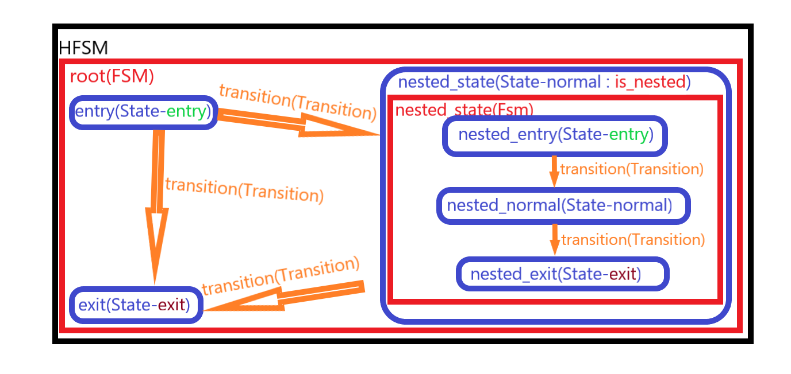

# Hierarchical Finite State Machine - V 1.0

​		As we all know, state machine is a very common design pattern. Here provide a powerful and easy-to-use Godot plugin for Hierarchical Finite State Machine with visual editing.

# Features

1. Perfect visual editor
2. Supports hierarchical nesting and can be used in complex situations
3. Diversified transition plans 
4. Two development modes: signal callback and attached state script
5. Develop base GDscript, compatible with Godot basic version and mono version
5. **Allows `C#`script to attached as state script( New).**
5. **Suppoets `GDscript` and `C#` script to implement the logic of transition( New, full version only). **

​	

# Tutorial

> + Convention
>
>    + `HFSM` :  Hierarchical Finite State Machine 
>
>    + `FSM` : Finite State Machine
>
>    + `State`: the State which in `FSM`
>
>    + `Transition` : the Transition to connect States in `FSM`
>
> + `HFSM` structure:
>
> 
>

## Installation

​		Clone this repo and copy `addons` folder in your project,then Activate this pluginin `Project Settings -> Plugins`.

> NOTE:
>
> ​		Please obey the license(read LICENSE.md for more) when you using this plugin.
>
> + The full version is under a custom license.
> + The trial version is under the GNU Lesser General Public License v3.0 (LGPL-3.0).

## Learn the HFSM editor

​		When you add a `HFSM` node to the scene tree and select it, the HFSM editor will pop up at bottom.


### Variable List


  1. Extend button : Hide or expand more information. After expansion, you can change the order of variables or add variable comments, as shown in the following figure:


  2. Add button : Add a new variable to HFSM.

     > Note: you must make a unique name for the variable after adding it, otherwise the variable will be ignored at run time


  3. Hide button : When designing a state machine, if the list hinders observation, it can be hidden, and the visibility of the list can be restored in the right click popup menu.

### Variable Editor
​		Click "add new variable" in variable list to add a variable editor.


 1. Move buttons :  When there are multiple variable editors, you can change there order.

 2. Variable type option button : Used to select the type of the variable.

    

	>    + Trigger : it can persist only one frame(default physics frame,but it will be idle frame if HSFM's Process Mode is set at "Idle") after being trigger.
	>    + The behavior of other variable types is the same as that of ordinary variables.

3. Variable name : If the name of new variable or is null or already exist, it will be ignore in runtime.

4. Variable comment : Can help you understand the meaning of the variable if your variable name is not intuitive, and this is not necessary.

5. Delete button : Delete the variable.

6. Drag area: Drag the variable to the inspector of the transition whose "transition type" is set to "variable" and add the variable expression. Only then can the variable work in HFSM.

    > NOTE :
    >
    > ​		If the variable name is illegal, the variable cannot be added as a variable expression.

### Right click Popup Menu

​		Press the right mouse button in the editing interface to pop up.


 1. Add State : Add `State` in current location

 2. Create Transition : This option is only available when you right-click the mouse over the State . Shortcut: `Shift + left click`.

 3. Script :This option is only available when you right-click the mouse over the `State`.

	+ Open script : This option is only available if a script is attached to the` State`.
	
	+ Create new script : This option is only available if the `State` has not contain a script. It will pop up a script create dialog, and attach the new script to the `State` automatically after the new script is created.
	
	+ Attach exist script : This option is only available if the `State` has not contain a script. It will pop up a script selected dialog, and attach the selected script to the `State`.
	
	+ Remove script : This option is only available if a script is attached to the `State`. It will remove the script which was attached to the `State`.
	
	> NOTE :
	>
	> + Only [correct script](#state-behavior--code-control) can be attached to `Stat`e.
	
4. Copy : This option is only available if there have States or Transitions are being selected. The selected States and Transitions will be copied. Shortcut key: `Ctrl + C`.

5. Paste :  This option is only available after there have States or Transitions been copied. The copied object will be pasted, which can be pasted across `FSM` to realize simple reuse. Shortcut key: `Ctrl + V`.

   > NOTE :
   >
   > + If the States at both ends of the copied Transition are not completely copied, the transition will not be pasted.
   >+ The pasted State's name will be appended `_` until the State's name is not repeated within the FSM which contain this State.
   
6. Duplicate : This option is only available if there has States or Transitions are being selected. It will Copy, offset and paste the selected objects.

   > NOTE :
   >
   > + If the States at both ends of the copied Transition are not completely copied, the transition will not be duplicate.
   >+ The pasted State's name will be appended `_`  until the State's name is not repeated within the FSM which contain this State.
   
7.  Delete : This option is only available if there has States or Transitions are being selected. It will delete the selected objects.

8. Convert to Nested State Machine : This option is only available if there has States or Transitions are being selected and right click at State to pop up the menu. Even if the design of HFSM is not clear at the initial stage of design, the cumbersome structure can be easily converted to a nested FSM.

   > NOTE :
   >
   > + The State ,which is pointed by mouse when right click, will be set as a Entry State for the new nested FSM.
   >+ If the State to be set as a nested FSM is attached to the script, the script will be removed and attached to the entry State in the nested FSM.
   > + All Transitions connected to the selected state will be deleted if the States which connected to both sides is not fully selected, unless the State connected to Transiton is set to nested FSM.

9. Show Variable List at here : Whether the variable list is hidden or not, it will be displayed at the right click position.

### FSM path


​		This Item is composed of a group of buttons, indicating the path of the current FSM. The last key is the position of the current FSM, and the button is disabled. Click the previous button to jump to the target FSM.

### Toolbar 


​		The last button is to toggle the visibility of the Transitions comment 


   > **NOTE:**
   >
   > ​		**The first three buttons, is related to zoom, are not recommended to use in the current version, which may cause some nonfatal bugs. Currently, the known bug is the node drag exception.**
### Mini Map
​		If your Godot version is newer than 3.2.2, a mini map will be displayed in the HFSM editor.
>NOTE :
>		At present, the display of mini map is not good enough. The Transitions will show at mini map without rotation. ~~I have been submitted a Proposal for this error.~~ The opinion of official developer is that `Graph` and `GraphNode` are not for this occasion, and have not plan to realize the feature of showing rotation in mini map.


## State

​		The smallest unit of `HFSM`, you can create a new state through the right click menu.

### State Inspector Properties


1. State Name

   ​		The name of State, is useful for judging in the code of signal callback. It is not only used to judge the current State directly, but also used to indicate the path of FSM. Therefore, please name your State reasonably, recommend to use snake_case to name State.

> NOTE:
>
> ​		You can modify the state name by select the State, and single click on it name in HFSM editor.

2. State Type


+ Normal : Most commonly used type with complete State behavior (Initialization, Entry, Update, Physical update, Exit).
+ Entry : Each FSM must contain a unique Entry State, which is used to indicate the starting point when entering the FSM, and also has a complete State behavior.
+ Exit : This type of State has only three behaviors: Initialization, Entry and Exit. An FSM can contain multiple Exit States to indicate the end point of the FSM. When the FSM runs to the exit state, it will no longer run until it is reseted manually or entered again.

> NOTE :
>
> ​		The Nested FSM of Exit State will not be run.

3. Reset Properties When Entry

   ​		Default is true, and will reset all custom properties when this State is entered. If false, all custom properties will persist.

4. State Script--**New: C# Support**

   ​		A white box will be showed on the State, which is attached the script, as a prompt, as shown in the following figure:


​		It is recommended to create, attach and remove State scripts through the right click menu. The State script property in inspector can also be edited, but it is not so convenient.

​		~~Currently, only `GDScript` is supported,~~ Support `GDScript` and `C`, and the script must use the "HFSM State Template" template provided by this plugin. When you create a script through the right click menu, the template will be selected by default.

> NOTE:
>
> ​		If the State already has a script attached, when you double-click the State, it will jump to the script editor and load the State script.

5. Is Nested

   ​	If true, a FSM will be nested in the State, then display a Button to use to entry the nested FSM and add a new property :Rest Nested Fsm When Entry. As follow figure show.


+ Rest Nested Fsm When Entry:

  ​		When entering a State which contain a nested FSM, it will also enter its nested FSM. If this property is true, it will be reset when entering the nested FSM. The reset behavior includes:

  1. Set the Entry State and Exit States of the nested FSM to which perset in the editor.
  2. Reset all States in the nested FSM when enter they.

### State Behavior & Code Control

​		This is the **State script template( `GDScript` version)** provided by this plugin.

```python
extends "res://addons/hierarchical_finite_state_machine/script/source/state.gd"

#You can use 'hfsm' to call the HFSM which contain this state , and call it's menbers.
#Please browse document to find API.

###agents list-start# please not modify this line.
###agents list-end# please not modify this line.
###nested fsm state-start# please not modify this line.
###nested fsm state-end# please not modify this line.
#======================================================
#--------------------Custom Signals--------------------
#======================================================

#======================================================
#-------------------Custom Properties------------------
#======================================================

#======================================================
#--------------------Custom Mechods--------------------
#======================================================

#======================================================
#--------------------Override Mechods------------------
#======================================================
#This funcion will be called just once when the hfsm is generated.
func init()->void:
	pass

#Will be called every time when entry this state.
func entry()->void:
	pass

#Will be called every frame if the hfsm's process_type is set at "Idle" or "Idle And Physics",
#and will be called every physics frame if the hfsm's process_type is set at "Physics".
#(In order to ensure the function completeness)
#Note that this method will not be called if this state is an exit state
func update(delta:float)->void:
	pass

#Will be called every physics frame if the hfsm's process_type is set at "Physics" or "Idle And Physics",
#and will be called every frame if the hfsm's process_type is set at "Idle".
#(In order to ensure the function completeness)
#Note that this method will not be called if this state is an exit state
func physics_update(delta:float)->void:
	pass

#Will be called every time when exit this state.
#Note that this method will be called immediatly after entry() if this state is an exit state.
func exit()->void:
	pass

```

**NEW:** This is the **State script template( `C#` version)** provided by this plugin.

```c#
/*
	You can use 'Hfsm' to call the HFSM which contain this state , and call it's menbers.
	Please browse document to find API.
	
	== Note!! == 
	C# template can't auto replace class name, because the Template PlaceHolder grammar will be recognaize as C# grammar errs.
	Please Repalce you state class name Manually!!!
	
	== 注意！！== 
	C# 模板不能自动替换类名，因为模板占位符在会被识别为C#语法错误。
	请在创建改脚本后手动替换类名！！！
*/
using Godot;

// public class %CLASS%: HFSM.State
public class PlaceHolder: HFSM.State
{
	/*
		CSharpScript State version unsupport auto append agents and the state which is nest this state.
		Because Godot can't get latest CSharpScript.source_code without reboot project( event if after build).
		This feature will be considered to add if godot fix this bug. 

		C# 状态脚本不支持自动添加 代理变量 和 内嵌该状态的状态变量。
		因为Godot不能获取最新的C#脚本代码，除非重启项目(即使在build之后)。
		只有Godot修复了这个bug，该特性才会被考虑添加进来。 

		You can add them mamually as follow:

		// "Node" can be replace as the class name of agent node.
		// "agent_node_name" must be a snake_case name of agent node, but it can be replace as agent node's name(usually it is PascalCase) if the HFSM is disable rename agent node name as snake_case.
		//     (HFSM -> Inspector-> Advanced Setting-> check Disable Rename To Snake Case)
		public Node agent_node_name{set;get;}
		public Node agent_node_name_other{set;get;}
		
		// "Reference" can be repalce as the class name of state which is nest this state if it is coded in C#, 
		// "fsm_nested_state_name" must be a name "'fsm_'+ the state name of state which is nest this state."
		public Reference fsm_nested_state_name{set;get;} 

		// "Node"可以被替换为代理节点的具体类名.
		// "agent_node_name"必须是代理节点的snake_case名称，但是当禁用HFSM重命名代理节点名称为snake_case的功能时，你可以将其替换为代理节点的名称（通常为PascalCase）。
		//     (HFSM -> 监视器 -> Advanced Setting-> 勾选 Disable Rename To Snake Case)
		public Node agent_node_name{set;get;}
		public Node agent_node_name_other{set;get;}
		
		// 如果嵌套该状态的状态附加了C#编写的脚本，"Reference"可以被替换为具体的类名。 
		// "fsm_nested_state_name"必须是 "'fsm_'+被该状态嵌套的父级状态名称."
		public Reference fsm_nested_state_name{set;get;} 
	*/
	
	
	/// <summary>
	/// This funcion will be called just once when the hfsm is generated.
	/// </summary>
	public override void Init(){
		// Your Init logic...
	}
	/// <summary>
	/// Will be called every time when entry this state.
	/// </summary>
	public override void Entry(){
		// Your Entry logic...
	}
	/// <summary>
	/// Will be called every frame if the hfsm's process_type is setted at "Idle" or "Idle And Physics",
	/// and will be called every physics frame if the hfsm's process_type is setted at "Physics".
	/// (In order to ensure the function completeness)
	/// Note that this method will not be called if this state is an exit state.
	/// </summary>
	/// <param name="delta">The interval between last update, in second.</param>
	public override void Update(float delta){
		// Your Update logic...
	}

	/// <summary>
	/// Will be called every physics frame if the hfsm's process_type is setted at "Physics" or "Idle And Physics",
	/// and will be called every frame if the hfsm's process_type is setted at "Idle".
	/// (In order to ensure the function completeness)
	/// Note that this method will not be called if this state is an exit state
	/// </summary>
	/// <param name="delta">The interval between last update, in second.</param>
	public override void PhysicsUpdate(float delta){
		// Your Physics Update logic...
	}
	/// <summary>
	/// Will be called every time when exit this state.
	/// Note that this method will be called immediatly after entry() if this state is an exit state.
	/// </summary>
	public override void Exit(){
		// Your Exit logic..
	}
}
```


+ State Behavior

  ​	A state has 5 behaviors, which correspond to 5 overridable methods in the script template:

+ `init()`/`Init()` : Will be called when HFSM is generated, it is usually used to initialize variables and obtain objects. After the behavior is executed, all variables will be determined as initial values.

+ `entry() `/`Entry()`: Execute every time when enter the State.

> NOTE:
>
> ​		If the State has a nested FSM, the entry behavior of the Entry State in the FSM will be executed after this State's entry behavior executed.

+ `update(delta:float)`/`Update(float delta)`  : Will be executed during the processing step of the main loop if this state is not exited. It means that  the delta time since the previous frame is not constant, and delta is in second.(analogy with `Node._process(delta)`)

> NOTE :
>
> + If the State has a nested FSM and is not terminated, the update behavior of the current State in the nested FSM will be executed further.
> + If the State type is Exit, the update behavior is not executed.

+ `physics_update(delta:float) `/`PhysicsUpdate(float delta)`:  Will be executed during the physics processing step of the main loop if this state is not exited. It means that  the delta variable should be constant, and delta is in second.(analogy with `Node.__physics_process(delta)`).

> NOTE :
>
> + If the State has an nested FSM and is not terminated, the physics update behavior of the current State in the nested FSM will be executed further.
> + If the State type is Exit, the physics update behavior is not executed.

+ `exit()`/`Exit()` : Will be executed when exit the State.

> NOTE :
>
> + If the State's type is Exit, its update and physics update behaviors will not be executed, and the exit behavior will be executed immediately after entry behavior finished.
> + If the State has an running nested FSM, it will get the current State of the nested FSM, if this current State still has an nested FSM, it will trace back until the last State has no nested FSM. Then it will execute the exit behavior of these States in reverse order, terminate the nested FSM, and finally execute the exit behavior of this State.
> + If the State is exited, its nested will be terminated if exist.

2. The Usage of State Script Template

+ Points for attention of using State script template :

  ​		The purpose of using this template is not only makes it easy for you to build the State function, but also to synchronize the HFSM settings to the script. Therefore, there are some points to pay attention to:

  + Ensure the extension/inheritance of script is correct.

    `GDScript`:
  
    ```python
    extends "res://addons/hierarchical_finite_state_machine/script/source/state.gd"
    ```

    `C#`: inherit from `HFSM.State`.

    > Only the script which have correct extension/inheritance can it be instantiated when HFSM is generated.
  
  + Ensure that the comments used as tag has the correct text **(Only work on `GDScript`version)**:
  
    ```python
    ###agents list-start# please not modify this line.
    ###agents list-end# please not modify this line.
    ###nested fsm state-start# please not modify this line.
    ###nested fsm state-end# please not modify this line.
    ```
  
    > Only by not changing these four lines of comments, can HFSM's agent configuration and the State object which contain the nested FSM be synchronized to the State script correctly (because the plugin synchronizes it by matching text).
  
  ​         Only scripts that meet the above conditions can be attached to a State. However, you can modify it after attaching, and the plugin will not detect its qualification in real time. It is strongly recommended that you do not make any changes to this 5 lines of text in the State script , so as to ensure complete additional features in the script.
  
+ Agent Node & State which contain Nested FSM :

  ​		After you set the agents correctly in the HFSM inspector(read [HFSM's Inspector Porperties](### · HFSM's Inspector Porperties) for more), a series of variables representing the agent nodes will be added to all the State scripts belonging to the HFSM. The example is as follows:

  ```python
  ###agents list start# please not modify this line.
  const Player = preload("res://addons/hierarchical_finite_state_machine/demo/test_2d_platform_player/Player.gd")
  var player : Player 
  ###agents list end# please not modify this line.
  ```

  ​		When a state with nested FSM has a state script, the plugin will automatically add a variable representing this State for all States in nested FSM and the variable name is "fsm_xxx", "xxx" is the name of the State, and its type is referenced from the script of the state. The example is as follows:

  ```python
  ###nested fsm state-start# please not modify this line.
  const NestedFsmState = preload("res://addons/hierarchical_finite_state_machine/demo/hfsm_test/hfsm_state_nested_fsm.gd")
  var fsm_nested_fsm : NestedFsmState
  ###nested fsm state-end# please not modify this line.
  ```

  ​		Therefore, when building the State behavior, you can easily call the nodes outside HFSM and the members in the State, which contain nested FSM , in the States belong to its nested FSM.

  > <font color=red>**NOTE **</font>:		
  >
  > ​	Please <font color=red>save your modify</font> of state scripts <font color=red>in time</font>. Otherwise you will <font color=red>lost modify</font> when your modify HFSM's agents. add and remove any state script.
  >
  > **For `GDScript` users**:
  >
  > ​	Do not modify or assign values to these variables or class names manually. They will be assigned values when the HFSM is generated.
  >
  > **For `C#` users**:
  >
  > ​	1. You must replace `C#` state script class name **manually (the same as file name)** after creating from template, because the template place holder is error `C#` grammar.
  >
  > ​	2. Due to bug of Godot,`C#` state script can't add these properties automatically: `CSharpScript.source_code` can't get the latest code of `C#` script, even if after build the project, unless reboot the project.
  >
  > ​	This feature will be considered to add if godot fix this bug.
  >
  > ​	Currently, you can define these properties **manually **to access them in runtime by naming them **<font color =red>correctly</font>**:
  >
  > ```c#
  > // "Node"可以被替换为代理节点的具体类名.
  > 	// "agent_node_name"必须是代理节点的snake_case名称，但是当禁用HFSM重命名代理节点名称为snake_case的功能时，你可以将其替换为代理节点的名称（通常为PascalCase）。
  > 	//     (HFSM -> 监视器 -> Advanced Setting-> 勾选 Disable Rename To Snake Case)
  > 	public Node agent_node_name{set;get;}
  > 	public Node agent_node_name_other{set;get;}
  > 
  > 	// 如果嵌套该状态的状态附加了C#编写的脚本，"Reference"可以被替换为具体的类名。 
  > 	// "fsm_nested_state_name"必须是 "'fsm_'+被该状态嵌套的父级状态名称."
  > 	public Reference fsm_nested_state_name{set;get;} 
  > ```
  >
  > 

## Transition


​		It is used to connect State, determine the direction of transition, and shift State when meeting the Transition conditions. It can be created either by right click menu or by shortcut key `Shift+left click`. When you select a transition, its inspector property are as follows :


​		Neither of the first two properties can be edited, indicating only the States connected by both sides of the Transition.

​		There are currently ~~three~~ **four** types of Transition (Auto, Variable, Expression,**Script(New)**) ,and sufficient to cope with ~~the vast majority of ~~ **all** cases. Set the type of transition through the "Transition Type" in the inspector.


### State Transit Behavior

​		When meeting the Transition conditions, the FSM which contain this Transition will occur the State transit behavior. A complete transit behavior includes:

​		Exit current State (execute exit() in State script ), then entry the target State which be pointed by Transition (execute entry() in target State's State script).

### Auto Transition

​		There are 5 modes, which can be selected by "Auto transit mode" in the inspector.


  1. Delay timer:

     

     ​		In this mode, by configuring the delay time, when FSM enters the start State of the Transition, the Transition will start countdown according to the delay time you set. When the countdown ends, the condition of the Transition is true.

  2. Nested Fsm Exit :

     

​		Only when the start State of the Transition contain a nested FSM, the condition of the Transition can be true. When the nested FSM of the start State runs to its Exit State and exit behavior is finished, the condition of the Transition is true.

  3. Manual Exit :

     

​		In this mode, when the start State of this Transition execute `manual_exit()` in normal State behavior, the condition of the Transition is true.

  4. Update times :

     

     ​		In this mode, when FSM enters the start State of the Transition, it will start to count the number of updates (that is, the number of times `update()` is executed). When the number of times you set is reached, the condition of the Transition is true.

  5. Physics Update times :

     

     ​		In this mode, when FSM enters the start State of the Transition, it will start to count the number of physics updates (that is, the number of `times physics_updates()` is executed). When the number of times you set is reached, the condition of the Transition is true.

### Variable Transition

​		The condition of the Transition is set by adding variable expression to it. This type is adequate for most cases.

> NOTE :
>
> ​		If not add variable expression, the condition for the Transition will never be set to true.


​		You can add variable expressions by dragging a variable from a Variable List to the inspector:


> ​		When you press the expand button, you can display more information about variable expressions, and you can change the order of expressions:
>
> 
1. Operation Mode :


+ And Mode : Only when all variable expressions are met, the condition of the Transition is true.

+ Or Mode : As long as a variable expression is met, the condition of the Transition is true.

2. Variable Expression Editor :

   ​	When you drag a variable to the inspector of the variable Transition, a variable expression editor is added based on the type of variable. You can edit the Comparator, compare value, or trigger mode for the variable expression. Note that the compare value should match the variable type.

|              |         Trigger          | Boolean  |         Integer          |          Float           |  String  |
| :----------: | :----------------------: | :------: | :----------------------: | :----------------------: | :------: |
|  Comparator  |                          | == ;  != | == ; != ; > ; >= ; < ;<= | == ; != ; > ; >= ; < ;<= | == ;  != |
| Trigger Mode | Force mode ; Normal mode |          |                          |                          |          |

+ Comparator : The same meaning as when you write expressions in your code.
+ Trigger Mode : Trigger variable is controlled by `set_variable()` or `set_trigger()`. Different trigger mode will have different effects on the Transition :
  + Force mode : When the trigger is triggered, the condition of the Transition will be true, no matter what the operation mode of the variable Transition is and whether other variable expressions are met.
  + Normal mode : As a normal variable expression, it follows the constraint of operation mode, it means that :
    + If is in And Mode, the condition is true only when other variable expressions are met and the trigger is triggered.

    + If is in Or Mode, when other variable expressions are met or the trigger is triggered, the condition of the Transition is true.
### Expression Transition

​		Transition which is this type has ~~highest~~ higher flexibility and can cope with almost all situations. On the other hand, it may consume more performance than variable Transition, although it's very small on macroscopic scale.


+ The upper editor is used to edit expression :

  ​		The object identifiers you can use  must be included in below :

  + `hfsm` : The `HFSM `which contain this Transition.
  + `from_state` : The` State` which is this Transition connected from.
  + `to_state` : The `State `which is this Transition connected to.
  + Name of all agent nodes configured in HFSM : corresponding agent node object.
  + All the built-in singletons of Godot, such as `nput`, they can be found in the second item, `@ globalscope`, in the Godot document.

+ The below editor can be used to add comment. If your expression is very complex, it can help you to understand the meaning of the expression.

  ​		By default, there has a default comment in order to prompts you to edit expression.

> NOTE :
>
> +  The text editor does not provide code completion, error prompt and other features. Therefore, when you edit an expression, you need to carefully confirm whether the expression is wrong, otherwise it may print errors at runtime.
> +  Expression may be a confusing concept for novices. Please don't write it as method, assignment or return statement, etc.

## New--Script Transition (full version only)

​	This is the most flexible type of transition, support both `GDScript`and `C#`. The only drawback is that your should manage your script resource by yourself( because these script must be created externally).

  

​	Just drag your transition script to `ConditionScript`.

> Note: Current your can't click and create script for it directly, and must create externally then attach it.

​	Of course, there have a few small constraint for transition script:

		1. Must extends from `Reference(GDScrikpt) `, or inherits from `Godot.Reference`.
		1. Must have ability of being constructed without arguments, i.e. `_init()`must without arguments or  all arguments have  default value( In `C#` script, a object which can be used in Godot must have ability of being constructed without arguments, this is not constrain by this plugin).
		1. Must contain a method which without arguments and return a `bool `value, name as `can_transit()`(GDScript) or`CanTransit()`(C#), to implement the determine logic of transit or not. 

> Node: Your script will not work if it is not obey above rules. 

​	Optionally, you can define a `Node` type property which name is `hfsm` in your transition script, It can be assign as its owner `HFSM` node just after being constructed.

​	For convenience, your can create transition script base on  the`Hfsm Transition Template`.

  

**The`GDScript`version template:**

```python
"""
	Must extends from Reference.
	必须扩展自 Godot.Reference
"""
extends Reference

const HFSM = preload("res://addons/hierarchical_finite_state_machine/script/hfsm.gd")
## <summary>
## This property is the HFSM node which contain this transion, will be set just after this condition is constructed.
## Your can access other objects( for example, agent nodes) though this property.
## 该属性是该转换所属的HFSM节点，将在该条件被构造后立刻赋值，你可以通过该属性来访问其他对象（如 HFSM 的代理节点等）
## </summary>
var hfsm : HFSM setget _set_hfsm
func _set_hfsm(v: HFSM) -> void:
	if is_instance_valid(v):
		hfsm = v
		agents = hfsm.agents

var agents: Dictionary

## <summary>
## Your must contain this method to varify transit or not. 
## 你必须实现该方法来标识是否进行转换。
## 1.zero arguments -- 无参数
## 2.name must be "can_transit" -- 必须以 "can_transit" 命名
## 3.must return a bool value -- 必须返回 bool 值 
## </summary>
## <returns> Transit or not</returns>
func can_transit() -> bool:
	# Your check logic.
	# for example:
	# return agents["player"].alive as bool
	return false;


```

**The C#`version template**

```C#
/*
	Must inherit from Godot.Reference, and file name must equal to class name.
	必须继承自 Godot.Reference, 并且脚本文件名必须与类名相同。
	
	== Note!! == 
	C# template can't auto replace class name, because the Template PlaceHolder grammar will be recognaize as C# grammar errs.
	Please Repalce you state class name Manually!!!
	
	== 注意！！== 
	C# 模板不能自动替换类名，因为模板占位符在会被识别为C#语法错误。
	请在创建改脚本后手动替换类名！！！
*/
using Godot;
using Godot.Collections;


// public class %CLASS% :Reference 
public class TemplateTransion :Reference 
{
	/// <summary>
	/// This property is the HFSM node which contain this transion, will be set just after this condition is constructed.
	/// Your can access other objects( for example, agent nodes) though this property.
	/// 该属性是该转换所属的HFSM节点，将在该条件被构造后立刻赋值，你可以通过该属性来访问其他对象（如 HFSM 的代理节点等）
	/// </summary>
	/// <value></value>
	public Node Hfsm{
		set{
			if (Object.IsInstanceValid(_hfsm)) _hfsm = value;
			var _agents = value.Get("agents") as Dictionary;
			if(_agents != null ){
				foreach (string agentName in _agents.Keys)
				{
					var agent = _agents[agentName] as Node;
					if (agent != null ) agents[agentName] = agent;
				}
			}
		}
		get=>_hfsm;
	}
	private Node _hfsm = null;


	private Dictionary<string, Node> agents = new  Dictionary<string, Node> ();

	/// <summary>
	/// Your must contain this method to varify transit or not. 
	/// 你必须实现该方法来标识是否进行转换。
	/// 1.zero arguments -- 无参数
	/// 2.name must be "CanTransit" -- 必须以 "CanTransi" 命名
	/// 3.must return a bool value -- 必须返回 bool 值 
	/// </summary>
	/// <returns> Transit or not</returns>
	public bool CanTransit()
	{
		// Your check logic.
		// for example:
		// return agents["Player"].Get("IsAlive") as bool
		return false;
	}
}

```

> **For C# users:**：
>
> 1. You must replace `C#` state script class name **manually (the same as file name)** after creating from template, because the template place holder is error `C#` grammar.
> 2. Because `Hfsm  `is a `Node`which coded by`GDScript`, you must access its script's members by Get(), Call(), and so on.


 ### Multiple Transitions

​		When the start States of multiple Transitions are the same, and multiple Transition's conditions are true, although it will not transit to the next State randomly, its priority is opaque to developers. Therefore, when you design the Transition's condition, you should avoid that multiple Transitions with the same start State can reach to true in the same frame.

## Finite State Machine - FSM

+ FSM consist of multiple States and Transitions, it can be either a single FSM (there has only one single FSM called "root") or a nested FSM nested in a State.

+ A FSM must contain only one Entry State to indicate the starting point of the FSM.

+ A FSM can contain multiple or no Exit States to indicate the exit of the FSM. the FSM will be terminated when the Exit State finished Its exit behavior.

  > NOTE :
  > + If root FSM runs to Exit State, the whole HFSM will be terminated after the exit behavior of the Exit State.
  > + When a FSM is terminated, it means that all State behaviors in the FSM will no longer be executed. However, this will not hinder the behavior of States which is nested by this FSM.
  
+ FSM path:

  ​		Although each State name is not allowed to be repeated in the same FSM, the State names across levels are allowed to be repeated. It is obviously inappropriate to directly use the name of State, is nested by a FSM, as the unique identification for the FSM. If we name each FSM separately, If we name each FSM separately, developers need to standardize the naming, which may lead to unclear meaning and inconvenient cross level operation.

  ​		In order to solve the problem of FSM identification, this plugin uses a path to identify each FSM. Each FSM has a path property  to identify itself, which is an `Array`. Note: the path of root FSM is` ["root"]`.

  ​		For example, a State named "state" is nested in the path `"root"->"nested_state_level_1"->"nested_state_level_2"->"state"`,The path of FSM which nested in State named "state" is `["root" , "nested_state_level_1" , "nested_state_level_2"]`. You can get State name which in upper level FSM, also can cut or modify the path to control State which in other FSM.


## Hierarchical Finite State Machine - HFSM


### HFSM's Inspector Properties

​		When you select the HFSM node in the scene tree, the inspector will display its properties as follows:


1. Active

   ​	Decide whether HFSM is allowed or not.

2. Process Type

   ​	The process type of HFSM mainly affects the behavior of State in FSM and the timing of HFSM signal transmission.


The difference between process types as follow :

|  | Idle And Physics | Idle | Physics | Manual |
|:----:|:------------------:|:----:|:-------:|:------:|
| update()/signal : updated | _process() | _process() | _physics_process() | manual_update() |
| physics_update()/signal : physics_updated | _physics_process() | _process() | _physics_process() | manual_physics_update() |

​		Here is a simple compare between different process types. Recommend to manage your custom behaviors properly by using `Idle And Physics`  (such as the stability requirement of frame rate), it is similar to use `nodes.__process()` and `nodes. _physics_process()`.

> NOTE:
>
> ​		It is not recommended to use Manual except for special situation. This type sets HFSM to Manual mode, and only update or physics update if you call `HFSM.manual_update()` or `HFSM.manual_physics_update()`. Unlike Idle mode or Physics mode, HFSM still calls `update()` and `physics_update()` in the State script to ensure the functional integrity of the State in this frame. Manual mode will only call the corresponding method. So when you're using Manual mode, make sure you know what you're doing.

3. Agents

   ​	This is a Dictionary property for adding agent nodes:

> Agent Node : In order to conveniently call other nodes in the scene when writing State scripts, here put forward the concept of agent node. When you set up a agent node for HFSM, it will automatically add a series of variables which meaning representing the agent node to the State script, and assign the correct objects to these variables in runtime.(Read [State Behavior & Code Control](#state-behavior--code-control) for more)


​		This property will automatically add a key value pair whose `key` is "null" and `value` is empty NodePath. It is convenient to add nodes in the scene tree without manually changing the type and adding the key value pair.


​		According to Godot's style of naming, in general, node names follow CamelCase, while variable names follow snake_case. To simplify the naming operation, the node name will be automatically converted to snake_case. If you don't need this feature, you can turn it off in advanced settings.

> NOTE :
>
> + A agent node will not be added repeatedly.
> + If the name of new added agent node already exist, it will be appended `_` until it doesn't repeated. 
> + <font color =aqua>**Your must save your modified state script <font color =red>in time</font> before you modify this property.Otherwise you will lost all unsave operation of them。**</font>
> + **New:** If your add a agent node which has a external script, its script will be preload and set as  the agent node variable's type in state script automatically. Otherwise it will be set as Godot Native class.

4. ~~Custom Class List~~（Removed, instead by the new feature.）

   ~~**Full version feature**~~

	​		~~This is a Dictionary property for adding custom class :~~
	
	​	~~If  the class of your agent node is a custom class which does not use "class_name" to defined as a global class, you can add the script absolute path (right click the script file in the file system and click "Copy Path" to copy its absolute path) to this list. When you added agent node is  the custom class which is added to this list, it will be set to State script with a correct variable type, and you can get benefit of code completion from its custom variable type. This is very helpful for code completion when the custom class does not need to be exposed to the global.~~
	
	​		~~According to Godot's style of naming, in general, file names follow snake_case, while class names follow CamelCase. So it will convert file name to CamelCase as it class name.~~


> ~~NOTE :~~
>
> + ~~It will not add repeatedly if the script file path already existed.~~
>
> + ~~If the newly added file class name already exists, it will be attached "_" until it doesn't repeat.~~

5. debug

   **Full version feature**
   
   ​	if checked, It will display a simple debugger at bottom left in runtime, to indicate the current State path.


​		From left to right by path, the top of each column is the name of nested FSM or State at the current level. The dark red one is last Exit State, and the translucent one is past State. It will not be displayed after 5 seconds.

6. Advanced  Setting


+ Disable Rename To Snake Case : If checked, the name of agent node will be used as its variable name in State script directly.
+ Force All State Entry Behavior :


​		a. Not Force : Default mode, the entry behavior of State will be decided by itself. 

​		b. Force Reset :  In this mode, all custom properties of each State will be reset to the initialized values when the State is entered.

​		c. Force Persist : In this mode, all custom properties of each State will not be reset to the initialized values when the State is entered.

> NOTE :
>
> ​		Even if set this property to Force Reset, all built-in properties (including variables used in the State class, variables which represents agent node, and variable which represents State which be nested FSM) will not be reset when entering the State.
>

+ Force All Fsm Entry Behavior : 


​		a. Not Force : Default mode, the entry behavior of FSM will be decided by itself. 

​		b. Force Reset :  In this mode, all FSM will execute [reset behavior of FSM](#strate-inspector-properties) when is entered.

​		c. Force Persist : In this mode, all FSM will not execute [reset behavior of FSM](#strate-inspector-properties) when is entered.

### The running of HFSM

1. When the game starts , after HFSM is added to the scene tree, all FSMs, States and Transitions will be instantiated and all States will be initialized.

2. When HFSM starts, the entry behavior of the Entry State in root FSM will be executed. If the State has a nested FSM, the entry behavior of the Entry State in the FSM will be further executed, and so on, until the last Entry State has no nested FSM.

3. Whenever HFSM update, it will start from the current State of root FSM. If the State has a nested FSM, it will update the current State in the nested FSM further , and so on, until the last State has no nested FSM.

4. Whenever HFSM physics update, it will start from the current State of root FSM. If the State has a nested FSM, it will physics update the current State in the nested FSM further , and so on, until the last State has no nested FSM.

5. Whenever a State in FSM has been Transited, after the transit behavior finish, if the target State has a nested FSM, the entery behavior of Entry State in the FSM will be executed further, and so on, until the last Entry State has no nested FSM.
6. Whenever a FSM enters the Exit State, if the Exit State has nested FSM, it will find the current State of the nested FSM, and trace back until the last State has no nested FSM. Then execute the exit behavior of these States in the reverse order of getting and terminating these Nested FSM, and finally execute the exit behavior of the Exit State and terminates FSM which contains this Exit State.

### The Emit Timinng of HFSM's signals

​		A HFSM has 6 signals :

 1. `inited() `: When the game starts, the generate behavior of HFSM will be delayed until the scene tree is ready (i.e. All the child nodes of HFSM.owner are ready, and this signal is emitted after HFSM.is_Inited being assigned to true.

 2. `entered(state,fsm_path) `: Emitted after a State is executed the entry behavior, the meaning of the callback parameters is as follows:

    + `state(String)` : The name of entered State.
    + `fsm_path(Array)` : The path of FSM which occur this behavior.

3. `exit(state,fsm_path)` : Emitted after a State is executed the exit behavior, the meaning of the callback parameters is as follows :

    + `state(String)` : The name of exited State.
    + `fsm_path(Array)` : The path of FSM which occur this behavior.

4. `updated(state, delta ,fsm_path)` : Emitted after a State is executed the update behavior, the meaning of the callback parameters is as follows :

    + `state(String)` : The name of updated State.
    + `delta(float)` : The frame time in second.
    + `fsm_path(Array)` : The path of FSM which occur this behavior.

5. `physics_updated(state, delta ,fsm_path)` : Emitted after a State is executed the physics update behavior, the meaning of the callback parameters is as follows :

    + `state(String)` : The name of physics updated State.
    + `delta(float)` : The physics frame time in second.
    + `fsm_path(Array)` : The path of FSM which occur this behavior.

6. `transited(from , to , fsm_path)` : Emitted when a State is transited, the meaning of the callback parameters is as follows :

    + `from(String)` : The name of State which transited from.

    + `to(String)` : The name of State which transited to.

    + `fsm_path(Array)` : The path of FSM which occur this behavior.

      > NOTE:
      >
      > + When FSM enters the Entery State, HFSM will emit this signal,too. In this case, the callback parameter `from` is "", and `fsm_path` is this FSM path.
      > + When FSM enters the Exit State, HFSM will emit this signal after the exit behavior of Exit State is finished,too. In this case, the callback parameter `to` is "", and `fsm_path` is this FSM path.

    > NOTE :
    >
    > ​       When these behavior occur in root FSM, the parameter `fsm_path` equal to `["root"]`.

## Recommended develop pattern

### Signal Callback

​		After the introduction of [the emit timinng of HFSM's signals](#the-emit-timinng-of-hfsms-signals), we can learn that HFSM has signals which describe all behaviors. Just connect HFSM's signals to the required objects, and you can develop it just like you use the signals of other nodes.

+ Advantage : Control the object itself by signal callback at appropriate timing. This way may suitable for thinking of most godoter, and need not create more file for HFSM to reduce the burden of maintaining file structure.

+ Disadvantage : If your HFSM's function is quite complex, it may lead to the script file of other objects and signal callback methods very lengthy, and increase the difficulty of code maintenance.

### Attach Script to State

​		You can attach the script, which use the template provided by this plugin, to the State which need to be customized behavior for controlling other objects, by using variables to control agent nodes and so on.

+ Advantage : Every State script controls other objects in itself(except when external signals are connected), so that the function of a single script is clear.
+ Disadvantage :
  + You must call other objects by using a agent variable, instead of controlling directly in those objects, this may annoy you. Even though this just a small problem.
  + If your HFSM's function is quite complex, it may create many State scripts, you need to manage these file's name and storage, in order to keep the file structure of your project.

### Conclusion

​		Combining the above two development modes and complement each other may be the best choice, but you should follow these principles:

1. The function of State which has higher level should take "Signal Callback" pattern as priority.

2. The function of State which has lower level should take "Attach Script to State" pattern as priority.

3. The States which at the same level should use the same develop pattern.

4. Minimize the number of States in the same FSM.

   > ​		The level of State is decide by its path index. The smaller the index is, the higher the level is. On the contrary, the larger the index is, the lower the level is. Among all FSMs,  the level of **root **FSM is highest.

   If you obey these principles, it can help you to maintain the code of HFSM. Even though this is  not mandatory.

# API

## HFSM

### Properties

1. bool is_inited[default :false]

   > is_inited() #getter
   >
   > Ready only. If true, the HFSM is generated.

2. bool active[default :true]

   > set_active(value) #setter
   > get_active() #getter
   >
   > If true, the HFSM is running. Note: It will not restart the HFSM if you set this property from false to true.

3. bool debug[default :false]

   > **Full version feature**
   >
   > set_debug(value) #setter
   > get_debug() #getter
   > If true, it will display a simple debugger at bottom left in runtime.

4. Dictionary agents[default : {"null" : NodePath("")}]

   > get_agents() #getter
   > Ready only.
   > if you get this property when "is_inited" is false, you will get a dictionary which key is means that agent node's names, and value is theirs NodePath which related HFSM in scene. For example :
   > {
   >	"agent1":NodePath(".."),
   > 	"agent2":NodePath("../Agent2"),
   > 	"agent3":NodePath("Agent3"),
   > }
   > if you get this property when "is_inited" is true, you will get a dictionary which key is means that agent node's names, and value is theirs instance. For example :
   > {
   > 		"agent1":[Node:1],
   > 		"agent2":[Node:2],
   > 		"agent3":[Node:3],
   > }


### Methods

1. void restart()

> Restart the HFSM, it means that all FSMs and States will be reset.

2. void set_entry_state(state_name : String , fsm_path : Array =["root"])

   > **Full version feature**
   >
   > Set a new Entry State for a FSM and set the original Entry State to the normal State.
   >
   > Use "fsm_path" to indicate the target FSM, and use "state_name" to indicate the target Entry State.
   >
   > If the State which is indicated by state_name is no exist in the target FSM, or the target FSM is not exist in HFSM, it will print an error.
   >
   > You can ignore "fsm_path" if you use HFSM as a single FSM(i.e. root FSM).

3. void set_exit_state(state_name : String , fsm_path : Array =["root"])

   > **Full version feature**
   >
   > Set a new Exit State for a FSM.
   >
   > Use "fsm_path" to indicate the target FSM, and use "state_name" to indicate the target Exit State.
   >
   > If the State which is indicated by state_name is no exist in the target FSM, or it is a Entry State, or the target FSM is not exist in HFSM, it will print an error.
   >
   > You can ignore "fsm_path" if you use HFSM as a single FSM(i.e. root FSM).

4. void set_unique_exit_state(state_name : String , fsm_path : Array =["root"])

   > **Full version feature**
   >
   > Set a unique Exit State for a FSM.
   >
   > Use "fsm_path" to indicate the target FSM, and use "state_name" to indicate the unique target Exit State.
   >
   > If the State which is indicated by state_name is no exist in the target FSM, or it is a Entry State, or the target FSM is not exist in HFSM, it will print an error.
   >
   > You can ignore "fsm_path" if you use HFSM as a single FSM(i.e. root FSM).

5. void set_normal_state(state_name : String , fsm_path : =["root"])

   > **Full version feature**
   >
   > Set a Normal State for a FSM.
   >
   > Use "fsm_path" to indicate the target FSM,  and use "state_name" to indicate the unique target Normal State.
   >
   > If the State which is indicated by state_name is no exist in the target FSM, or it is a Entry State, or the target FSM is not exist in HFSM, it will print an error.
   >
   > You can ignore "fsm_path" if you use HFSM as a single FSM(i.e. root FSM).

6. void force_entry(fsm_path : Array = ["root"] , entry_state_name : String = "")

   >**Full version feature**
   >
   >Force entry a FSM,  specify entry state is optional.
   >
   >Use "fsm_path" to indicate the target FSM, and use "entry_state_name" to indicate the target Entry State.
   >
   >If the parameter "fsm_path" is a valid path, it will execute a specific force entry behavior as follows: starting from the beginning of the current running path of HFSM and use the parameter "fsm_path" to match from front, until the element before the different one, these matched element will be a new array path by order, for indicating the FSM which should be exited. After the FSM exited, it will enter the Entry State which is indicated by you parameters( If you ignore the parameter "entry_state_name", the target State which will be entered is the exist Entry State in the target FSM). 
   >
   >If the State which is indicated by state_name is no exist in the target FSM, or the target FSM is not exist in HFSM, it will print an error.

7. void force_exit(fsm_path : Array =["root"])

   > **Full version feature**
   >
   > Force exit a FSM and terminate it. It will trigger a series of exit behavior (read [The running of  HFSM](#the-running-of-hfsm) for more).
   >
   > Use "fsm_path" to indicate the target FSM.
   >
   > If the target FSM is not exist in HFSM, it will print an error.
   >
   > You can ignore "fsm_path" if you use HFSM as a single FSM(i.e. root FSM).

8. void force_transit(target_state : String , fsm_path : =["root"])

   > **Full version feature**
   >
   > Force transit to a State by ignoring the direction of transition flow.
   >
   > Use "fsm_path" to indicate the target FSM, and use "state_name" to indicate the target State.
   >
   > It will exit the current State in target FSM if is not exited, then enter the target State (Even if the target State is current State of target FSM).
   >
   > if the target State is not exist in target FSM, or the target FSM is not exist in HFSM,or the target FSM is terminated, it will print a error.
   >
   > You can ignore "fsm_path" if you use HFSM as a single FSM(i.e. root FSM).

9. Array get_current_path()

   > Get the path of State which is current running.
   >
   > You should makes distinction with the common variable name which called `fsm_path`).
   >
   > "fsm_path" away indicate a path of FSM.
   >
   > While this method return the path of State. Only when the HFSM is terminated ,it will return `["root"] `which indicate the path of root FSM. 
   >
   > The most common usage is to get the name of the current running state:
   >
   > 
   >
   > ```python
   > onready var hfsm = get_node("HFSM")
   > 
   > func some_func():
   > 	var current_state :String = hfsm.get_current_path().back() 
   > 	if current_state != "root":
   > 		print("current state : " + current_state)
   > 	else :
   > 		print("the HFSM was terminated.")
   > ```
   >
   > 

10. Array get_previous_path()

  > Gets the State path that was run before the last transition.
  >
  > The note of this method is the same as `HFSM.get_current_path()`.

11. Dictionary get_variable_list()

    > Get all variables and their values, return a dictionary which key is variable name ,and value is vairbale value. 
    > For example :
    > {
    >
    > ​	"variable_trigger": false,
    > ​	"variable_boolean" : true ,
    > ​	"variable_integer" : 2 ,
    > ​	"variable_float" : 3.14 ,
    > ​	"variable_string" : "test_string" ,
    > } 

12. Variant get_variable(variable_name : String) 

    > Use `variable_name` to get the target variable's value.
    >
    > If the target variable is not exist in HFSM, it will print a error, and return null.

13. void set_variable(variable_name : String ,value )

    >Use `variable_name` to select a variable in HFSM, and set it value as the parameter `value`.
    >
    >If the target variable is not exist, or the target value is not match the variable type, this operate will fail and print a error.
    >
    >If the type of target variable is Trigger, it will ignore the parameter `value`, and trigger it directly.
    >
    >When you know exactly what type of variable you want to set, the following five methods are recommended.
    
14. void set_trigger(trigger_name : String)

    > To trigger a trigger which indicate by `trigger_name`.
    >
    > if the target variable is not exist or the target variable is not trigger, it will print a error.

15. void set_boolean(boolean_name : String , value : bool)

    > To set a boolean which indicate by `boolean_name` to `value`.
    >
    > if the target variable is not exist or the target variable is not boolean, it will print a error.

16. void set_integer(integer_name : String , value : int)

    > To set a integer which indicate by `integer_name` to `value`.
    >
    > if the target variable is not exist or the target variable is not integer , it will print a error.

17. void set_float(float_name : String , value : float)

    > To set a float which indicate by `float_name` to `value`.
    >
    > if the target variable is not exist or the target variable is not float, it will print a error.

18. void set_string(string_name : String , value : String)

    > To set a string which indicate by `string_name` to `value`.
    >
    > if the target variable is not exist or the target variable is not string, it will print a error.

19. void manual_update()

    > Update HFSM manually.
    >
    > Only valid when HFSM is inactive(active == false) and the process type of HFSM is set to Manual, otherwise it will print a error.

20. void manual_physics_update()

    > Physics update HFSM manually.
    >
    > Only valid when HFSM is inactive(active == false) and the process type of HFSM is set to Manual, otherwise it will print a error.

### Signals

​		Read [The Emit Timinng of HFSM's signals](#the-emit-timinng-of-hfsms-signals) for more

1. inited()

   > Emitted after HFSM is generated.

2. entered(state : String , fsm_path:Array)

   > Emitted after State is entered.

3. exited(state,fsm_path)

   > Emitted after State is exited.

4. updated(state, delta ,fsm_path)

   > Emitted after State is updated.

5. physics_updated(state, delta ,fsm_path)

   > Emitted after State is physics updated.

6. transited(from , to , fsm_path)

   > Emitted when State transiting.

## State(`GDScript` version)

​		Scripts attached to the State in HFSM inherit from this class, but you can not obtain the objects which inherited from this class directly outside HFSM.

> **For `C#` users:**
>
> ​	The usage of `HFSM.State` can refer to `GDScript` version's `State`.

### Properties

​		All State's properties are read only.

1. String state_name[default : ""]

   > get_state_name() #getter
   > The name of State, you can not edit it in runtime. Read only.

2. bool is_exited[default : false]

   > is_exited() #getter
   >
   > If true, this State is not running(not enter or already exited). Read only.

3. HFSM hfsm[default : null]

   > get_hfsm() #getter
   >
   > The HFSM instance which contains this State. Ready only.


### Methods

​		Read [State Behavior](#state-behavior--code-control) for more informations of overridable methods.

1. void manual_exit()

   > Exit State Manually , and execute its exit behavior.

2. void init()   

   > Overridable, called when HFSM is generated, values of all custom properties will be confirm as initial value.

3. void entry()   

   > Overridable, called when State is entering.

4. void update(delta : float)   

   > Overridable, called when State updating.

5. void physics_update(delta : float)   

   > Overridable, called when State physics updating.

6. void exit()   

   > Overridable, called when State exiting.


